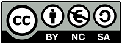

# Parts list
These are the parts intended for this PCB: 

1 x 0805 SMD Capacitor 47uF    (C1)  
2 x 0805 SMD Capacitor 10nF    (C2+C3)  
2 x 0805 SMD Resistor  1k Ohm  (R1+R2)  
1 x SOIC-8 SMD 555 IC  NE555DR (555)
1 x Potentiometer      5k Ohm  (POT)

C3 is an optional bypass capacitor
If you want a wider range for the firing rate, you can, for example, use a 470 Ohm resistor as R2 and a 10k Ohm potentiometer.

